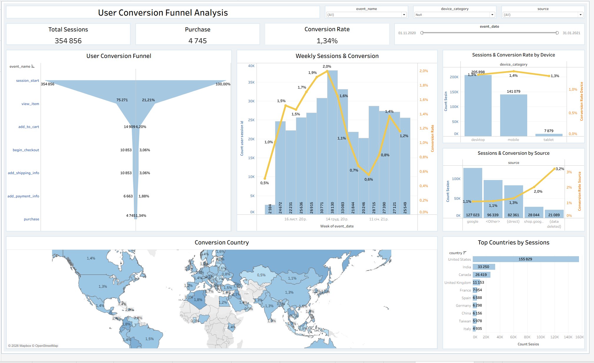

# Ecommerce Conversion Funnel Analysis

## 📊 Dashboard Preview

## 📌 Project Description
This project analyzes user behavior in an e-commerce funnel to identify drop-off points and optimize conversion performance.

The goal is to identify where users drop off and how conversion can be improved.

## 📂 Dataset
The dataset includes user session data with events such as:
- session_start
- view_item
- add_to_cart
- begin_checkout
- add_payment_info
- purchase

- ## 📈 Key Metrics
- Total Sessions: 354,856  
- Purchases: 4,745  
- Conversion Rate: 1.34%

- ## 🔍 Key Insights
- The biggest drop-off occurs between view_item and add_to_cart  
- Conversion rate peaks around early December and then declines  
- Desktop generates the most sessions, but conversion is similar across devices  
- Google is the main traffic source, but not the highest in conversion

- ## 🛠 Tools Used
- SQL (data analysis)  
- Tableau (dashboard & visualization)

- ## 📁 Project Structure
- [sql_analysis.sql](sql_analysis.sql) — SQL queries  
- [Dashboard Image](images/dashboard.png) — dashboard preview

- ## 🔗 Live Dashboard
[View on Tableau Public](https://public.tableau.com/views/1_17776363782090/UserConversionFunnelAnalysis?:language=en-US&:sid=&:redirect=auth&:display_count=n&:origin=viz_share_link)
